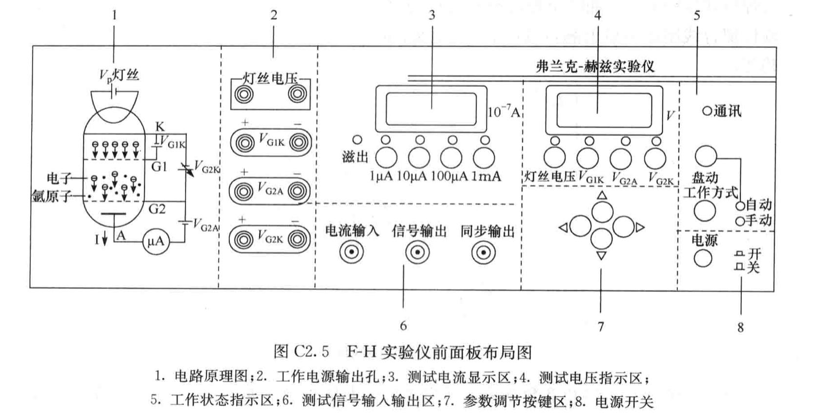

# C2 Franck Hertz experiment

## 实验目的

- 学习弗兰克-赫兹实验仪的使用方法
- 手动测量氩原子的电流-加速电压关系曲线，研究改变灯丝电压$V_F$，收集电压$V_{G_1K}$和抑制电压$V_{G_2A}$对曲线的影响

- 借助示波器和数据采集器，调整电压参量，找出氩管的最佳工作点

- 计算氩原子第一激发电位

## 实验原理

### 1. Borh原子定态能级理论

1913 年，为了解决经典理论上关于原子核外电子的理论矛盾，玻尔提出了原子轨道理论。

- 原子存在定态能级，电子只能在特定的轨道上运动
- 量子化条件：轨道角动量和能量是离散的
- 原子的能级由高能级向低能级发生跃迁时对外辐射光子，光子能量为两能级之间的能量差。

### 2. 弗兰克-赫兹实验

1914 年，弗兰克和赫兹用慢电子和单元素稀薄气体原子碰撞，成功使原子从低能级跃迁到高能级，并通过测量电子能量变化得到了原子定态能级之间能量差，验证了原子跃迁时吸收释放能量的不连续性。实验验证了玻尔的原子轨道理论。

### 3. Franck-Hertz实验仪

实验采用弗兰克-赫兹实验仪（F-H 实验仪）实现电子与单元素稀薄气体原子的碰撞，F-H实验管示意图如\ref{fig:illus-1}所示。

[C2_illus-1](attachments/C2_illus-1.png)

- 电子从灯丝端发射，经过电压 $V_{G_1K}$收集至$ K $极，进入加速区。

- 加速区内充满氩气。加速电压$V_{G_2K}$使电子在该区内加速通过，与氩原子发生碰撞。
  - 当电子与原子发生弹性碰撞时，二体系统几乎不发生能量损耗，电子正常通过；
  - 但当电子能量达到适当条件时，电子与氩原子发生完全非弹性碰撞或非弹性碰撞，原子将吸收电子动能，发生能级跃迁，电子能量下降。
- 在加速区后方，存在加有反向电压$V_{G_2A}$的减速区。通过加速区的电子若有足够的动能通过减速区到达阳极，电压表将检测到阳极电流。阳极电流的大小反应了电子能量损耗的情况。
- 从$0$开始，逐渐增大加速区电压$V_{G_2K}$，用实验仪手动采集或用示波器采集回路中产生的电流，得到电流$I_A$随加速电压$V_{G_2K}$增大而发生周期变化的图像，通过分析图像峰值之间对应的电压差即可得到氩原子发生跃迁时吸收能量所对应的电位差，即第一激发电位。

## 实验装置

### 1. F-H 实验仪主机

面板如\ref{fig:illus-2}所示

- 2-工作电流输出孔：灯丝电压无极性，其他有极性。
- 3-测试电流显示区：指示阳极电流大小。可选择量程。
- 4-测试电压指示区/7-参数调节按钮区：选择不同工作电压，通过按键设置各输出电压参数值。
- 5-工作状态指示区：可以选择手动或自动模式。

### 2. 外置式氩管

底座如\ref{fig:illus-3}所示

[C2_illus-3](attachments/C2_illus-3.jpg)

实验准备步骤要将底座上的插孔与实验仪主机插口对应连接。

## 实验内容及步骤

### 1. 初始化仪器并设定初始参数

- 连接线路，开机后预热20min
- 设置为手动模式
- 设置电流量程为1x
- 设置各工作电压值

### 2. 手动测量$I_A-V_{G_2K}$曲线，改变各工作电压，观察对曲线的影响

1. 参数设置完毕后，按启动键开始实验
2. 单方向按步长1V上调$V_{G_2K}$值，记录对应的$I_A$值
3. 分别改变$V_F$  ，$V_{G_1K}$ 和 $V_{G_2A}$，保持其他两电压值不变，按上述步骤重新测量$I_A-V_{G_2K}$曲线，以观察改变各工作电压对曲线的影响。本实验中，工作电压设置如表格\ref{tab:manual}
4. 比较并分析$V_F$  ，$V_{G_1K}$ 和 $V_{G_2A}$对实验曲线的影响	

|         | $V_F/V$ | $V_{G_1K}/V$ | $V_{G_2A}/V$ |
| :-----: | ------- | ------------ | ------------ |
| $EXP_1$ | 2.2     | 1.5          | 7.0          |
| $EXP_2$ | 2.0     | 1.5          | 7.0          |
| $EXP_3$ | 2.2     | 2.0          | 7.0          |
| $EXP_4$ | 2.2     | 1.5          | 8.5          |

### 3. 使用示波器自动采集数据，找出最佳工作点，并测量氩原子第一激发电位$U_0$

1. 将实验仪主机连接到示波器，示波器连接到监视计算机，打开监视计算机示波器虚拟面板
2. 设置实验仪工作方式为自动，设置各工作电压，设置$V_{G_2K}$扫描终止电压，按启动键开始扫描
3. 在示波器虚拟面板上导出实验数据和波形图。
4. 分别改变$V_F$  ，$V_{G_1K}$ 和 $V_{G_2A}$，保持其他两电压值不变，按上述步骤重新测量$I_A-V_{G_2K}$曲线，比较各组曲线，找出最佳工作点。本实验中，工作电压设置如表格\ref{tab:auto}

|         | $V_F/V$ | $V_{G_1K}/V$ | $V_{G_2A}/V$ |
| :-----: | ------- | ------------ | ------------ |
| $EXP_1$ | 2.2     | 1.2          | 7.0          |
| $EXP_2$ | 2.2     | 1.5          | 5.0          |
| $EXP_3$ | 2.2     | 1.5          | 7.0          |
| $EXP_4$ | 2.2     | 1.5          | 9.0          |
| $EXP_5$ | 2.3     | 1.5          | 7.0          |
5. 标定$I_A-V_{G_2K}$曲线，计算氩原子第一激发电位$U_0$

## 数据处理与分析

注：所有曲线都经过样条插值平滑处理。插值方法为单变量插值(UnivariateSpline)。光滑度的选择是经验的，具体参数可查看本项目源代码。

### 1. 手动测量$I_A-V_{G_2K}$曲线

**参数设定**（见\ref{tab:manual}行$EXP_1$）：

- $V_F=2.2V$
- $V_{G_1K}=1.5V$ 
- $V_{G_2A}=7.0V$

实验结果如\ref{fig:1}所示。可以观察到$I_A$随$V_{G_2K}$增加而呈类周期涨落变化，且本底电流逐渐升高。观察到峰值之间的$V_{G_2K}$电压差近似恒定。

### 2. 改变各工作电压，观察曲线变化

参数设定见\ref{tab:manual}行$EXP_2$，$EXP_3$和$EXP_4$

[fig.2](attachments/fig.2.png)

[fig.3](attachments/fig.3.png)

[fig.4](attachments/fig.4.png)

**结果分析**

- 如\ref{fig:3}，调低灯丝电压$V_F$，曲线本底电流和峰谷差值显著减小，归因于灯丝发射电子数减小。
- 如\ref{fig:4}，调高收集电压$V_{G_1K}$，观察到起始电压$U_S$减小，归因于电子更快被募集到加速区。观察到曲线本底电流和峰谷差值减小，原因不明。猜测可能原因为在加速电压有限情况下，电子脱离$G_1$极板速度有限，此时增大收集电压，更多电子被收集$G_1$极板，导致电子堆积聚集，降低了阴极的电势，抑制电子从灯丝转移到$G_1$极板，导致本底电流下降。
- 如\ref{fig:5}，调高抑制电压$V_{G_2A}$，曲线本底电流和峰谷差值减小，归因于高反向抑制电压对电子减速效应更显著。

### 3. 使用示波器自动测量并标定数据

选取$V_F=2.2V$，$V_{G_1K}=1.5V$ ，$V_{G_2A}=7.0V$实验数据作为标定依据。

示波器导出数据的插值拟合曲线峰值点和实验仪读取数据插值拟合曲线峰值点对应如\ref{tab:scale-x}和\ref{tab:scale-y}所示。

|    序列值    |  350  |  444  |  539  |  636  |  738  |  842  |
| :----------: | :---: | :---: | :---: | :---: | :---: | :---: |
| $V_{G_2K}/V$ | 18.24 | 28.64 | 40.16 | 51.84 | 64.16 | 76.80 |

|   CH1   | 0.159 | 0.330 | 0.522 | 0.697 | 0.898 | 1.057 |
| :-----: | :---: | :---: | :---: | :---: | :---: | :---: |
| $I_A/A$ | 0.444 | 0.915 | 1.338 | 1.742 | 2.074 | 2.390 |

拟合变换关系如\ref{fig:5}所示

[fig.5.1](attachments/fig.5.1.png)

[fig.5.2](attachments/fig.5.2.png)

使用如上拟合公式对示波器导出的数据进行变换，得到真实的$I_A-V_{G_2K}$数据。注意该变换公式仅对区间$V_{G_2K} \in [0,80]$有效。为保证数据完整性，超出该范围的数据将仍在图表中绘出，只不过这些点没有任何物理意义。为提醒这一点，$V_{G_2K} \in [0,80]$范围内数据已高亮显示。

### 4. 研究最佳工作点

参数设定见\ref{tab:auto}

[fig.6](attachments/fig.6.png)

[fig.7](attachments/fig.7.png)

[fig.8](attachments/fig.8.png)

**结果分析**

- 如\ref{fig:6}
  - 调高灯丝电压$V_F$，曲线本底电流和峰谷差值显著增大，有电离趋势，这是危险的。
  - 结合\ref{fig:2}，调低灯丝电压$V_F$，曲线本底电流和峰谷差值显著减小，不易于分析。
  - 综上，选取$V_F=2.2$是合适的
- 如\ref{fig:7}
  - 调低收集电压$V_{G_1K}$，两曲线差异并不明显，可观察到低收集电压曲线的本底电流稍大。基于减少电离风险的原则，调低收集电压是不合适的。
  - 结合\ref{fig:3}，调高收集电压$V_{G_1K}$，曲线本底电流和峰谷差值减小。基于保证较大的峰谷值以利于分析的原则，调高收集电压是不合适的。
  - 综上，选取是$V_{G_1K}=1.5V$合适的
- 如\ref{fig:8}
  - 调高抑制电压$V_{G_2A}$，曲线本底电流减小，而峰谷差值几乎不变，甚至有所提高。提示调高抑制电压是有益的。注意这里峰谷差值的结果与\ref{fig:4}结果有所不同，原因不明。
  - 调低抑制电压$V_{G_2A}$，曲线本底电流和峰谷差值显著增大，有电离趋势，这是危险的。
  - 综上，选取是$V_{G_2A}=9.0V$合适的

因此，最佳工作点选为$V_F=2.2V$，$V_{G_1K}=1.5V$ ，$V_{G_2A}=9.0V$

### 5. 在最佳工作点下测量氩原子第一激发电位$U_0$

实验结果如\ref{fig:9}所示

各峰值点对应的加速电压$V_{G_2K}/V$为：

[19.56, 28.77, 40.72, 52.32, 64.51, 76.83]

利用逐差法计算平均值为$11.62V$，标准差为$1.06V$

故氩原子第一激发电位$U_0=11.62 \pm 1.06 V$

## 思考题

1. 直接取激发曲线中各峰位间距平均值作为第一激发电位是否合理？
   1. 不合理。正确做法应该是逐差法。若直接取激发曲线中各峰位间距计算平均值，则实际上只有第一个数据和最后一个数据是有效的。将会引入较大的实验误差，因此不可取。
2. F-H管的$I_A-V_{G_2K}$曲线中，相邻两波峰的$V_{G_2K}$之差代表什么？波峰为什么具有一定宽度？波谷点的$I_A$为什么不等于0，且随$V_{G_2K}$增大而增大？
   1. 相邻两波峰的$V_{G_2K}$之差代表第一激发电位，即从电子刚好能被氩原子吸收能量开始到下一次能被吸收能量之间所需获得的能量做对应的电势差。
   2. 在电子没有达到使氩原子再次发生跃迁的能量水平时，电子与氩原子发生部分弹性碰撞或弹性碰撞，这导致波峰具有宽度。
   3. 实验所测得的电流是大量电子通过加速区的结果，并不是所有达到能量要求的电子都会与氩原子发生碰撞，这些没有发生碰撞的电子通过导致波谷点的$I_A$不等于0，且这些电子的速度随加速电压增加而增加。
3. $I_A-V_{G_2K}$曲线的第一个波峰$V_{G_2K}$是否是第一激发电位？
   1. 无法判断。在第一个波峰前，电子可能已经达到过第一激发电位，但由于能量不足以克服抑制电压，无法到达阳极，因此没有被记录。因此无法判断第一个波峰$V_{G_2K}$是否是第一激发电位。
4. 何为F-H管最佳工作点，如何确定？
   1. 最佳工作点：保证F-H管正常工作且数据质量最高的一组电压参数（灯丝电压$V_F$  ，收集电压$V_{G_1K}$ 和抑制电压$V_{G_2A}$）
   2. 确定：通过控制其他参数不变，调节一个参数，观察实验曲线。筛选使得曲线峰谷差较大和本底电流较小的参数作为最佳参数。再调节下一个参数，重复测定。
5. 定量描述F-H管各参数对$I_A-V_{G_2K}$曲线影响
   1. 依题四方法，测量多组不同参数下$I_A-V_{G_2K}$曲线，计算各组峰谷差和本底电流并进行拟合。计算峰谷差拟合模型最大值和本底电流拟合模型最小值即可。

---

## 附：实际实验参数

### 手动测量（Manual.csv）

|       | $V_F$ | $V_{G_1K}$ | $V_{G_2A}$ |
| :---: | ----- | ---------- | ---------- |
| $I_1$ | 2.2   | 1.5        | 7.0        |
| $I_2$ | 2.0   | 1.5        | 7.0        |
| $I_3$ | 2.2   | 2.0        | 7.0        |
| $I_4$ | 2.2   | 1.5        | 8.5        |

### 自动测量（Auto.csv）

|       | $V_F$   | $V_{G_1K}$ | $V_{G_2A}$ |
| :---: | ------- | ---------- | ---------- |
| $I_1$ | ~~2.1~~ | ~~1.5~~    | ~~7.0~~    |
| $I_2$ | 2.2     | 1.2        | 7.0        |
| $I_3$ | 2.2     | 1.5        | 5.0        |
| $I_4$ | **2.2** | **1.5**    | **7.0**    |
| $I_5$ | 2.2     | 1.5        | 9.0        |
| $I_6$ | ~~2.2~~ | ~~1.8~~    | ~~7.0~~    |
| $I_7$ | 2.3     | 1.5        | 7.0        |

- $I_1$由于触发源选择有误，导致电压出现较大偏移，无法与其他组别相比较，因此舍弃
- $I_6$由于实验结果反常，原因不明，严谨起见不予展示。
